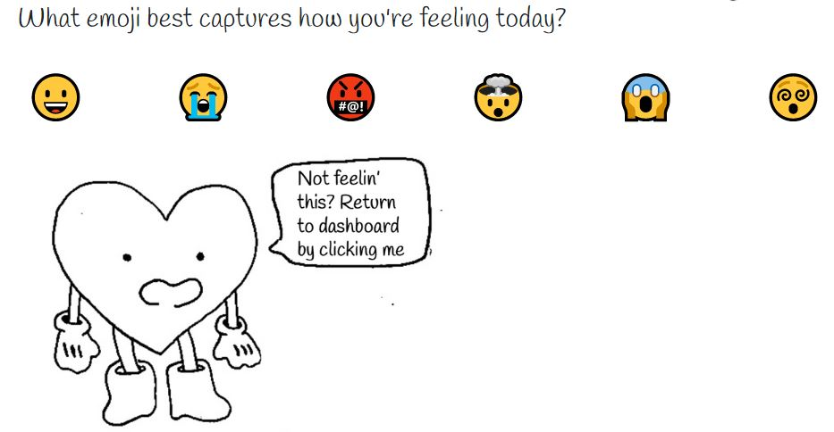

# ***Mood-Remedy 📰 Journaling for your every mood...***

[GitHub Repository](https://github.com/ccaitano/mood-remedy)

[Deployed Application](https://mood-remedy.herokuapp.com/)
## **Description** 📚

*Mood-Remedy* is an application designed for people interested in journaling. Users can log in or sign up. If logging in they will be prompted to enter their email/username and password. If they haven't created an account they can input a username, email and create a password. 

## **Table of Contents** 📄

* Installation
* Usage
* License
* Contributing
* Testing
* Technology
* Questions

---

## **Installation** ⚙️

Visit our [repository](https://github.com/ccaitano/mood-remedy) to reference: any materials, our process in developing the web page, and the people involved in creating the web page. Visit our [deployed application](https://mood-remedy.herokuapp.com/) to experience the web page.

### **Usage** 💻
* Users can login in to a previous account or sign-up for a new account.

    

* Once signed in, a user will see their personalized dashboard.

    

* Users can select one of the emojis provided on the 'Find Your Vibe' page

    

* Users will be provided with a question associated with their selected mood. 
* If they choose to respond to the question, they will be prompted to a text modal where they can respond to the question and log their response.

    

* If then choose none of the above, the user will be able to re-select their mood.  
* Users may view their previous responses on the 'Previous Responses' page

    

* On the user's main dashboard there will be a pie chart with the users previous mood distribution.

    

### **License** 💳

MIT License

Copyright © 2022

Permission is hereby granted, free of charge, to any person obtaining a copy of this software and associated documentation files (the "Software"), to deal in the Software without restriction, including without limitation the rights to use, copy, modify, merge, publish, distribute, sublicense, and/or sell copies of the Software, and to permit persons to whom the Software is furnished to do so, subject to the following conditions:

The above copyright notice and this permission notice shall be included in all copies or substantial portions of the Software.

THE SOFTWARE IS PROVIDED "AS IS", WITHOUT WARRANTY OF ANY KIND, EXPRESS OR IMPLIED, INCLUDING BUT NOT LIMITED TO THE WARRANTIES OF MERCHANTABILITY, FITNESS FOR A PARTICULAR PURPOSE AND NONINFRINGEMENT. IN NO EVENT SHALL THE AUTHORS OR COPYRIGHT HOLDERS BE LIABLE FOR ANY CLAIM, DAMAGES OR OTHER LIABILITY, WHETHER IN AN ACTION OF CONTRACT, TORT OR OTHERWISE, ARISING FROM, OUT OF OR IN CONNECTION WITH THE SOFTWARE OR THE USE OR OTHER DEALINGS IN THE SOFTWARE.

### **Testing** 📝
All testing was done by the developing team.

### **Technology** 💡

* Node.js
* Chart.js
* MySQL
* Handlebars
* Heroku
* Excalidraw
* GNU Image Manipulation Program

### **Contact** ☎
* Sterling Cafrae **-** [Github](https://github.com/scarfrae)**,** [LinkedIn](https://www.linkedin.com/in/sterling-carfrae-a2a8151a5/)
* Aliyah Musaliar **-** [Github](https://github.com/musaliyah)**,** [LinkedIn](https://www.linkedin.com/in/aliyah-musaliar-9582a5149/)
* Cheryl Caitano **-** [Github](https://github.com/ccaitano)**,** [LinkedIn](https://www.linkedin.com/in/cheryl-caitano-0a8a8250/)
* Avleen Dhillon **-** [Github](https://github.com/adhillon0817)**,** [LinkedIn](www.linkedin.com/in/avleen-dhillon-2116371b4)
***
